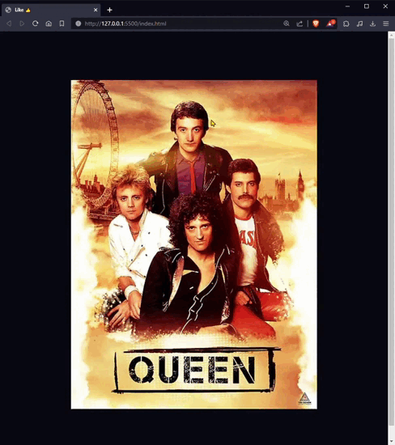

# LIKE
Este es un pequeño proyecto de un tutorial de [midulive](https://www.youtube.com/shorts/vDIfZD4K7NI).

Consite en:

🎯 al hacer doble clic en la imagen, llamar a la animación: "like"

🎯 la animación simula un like de redes sociales.

